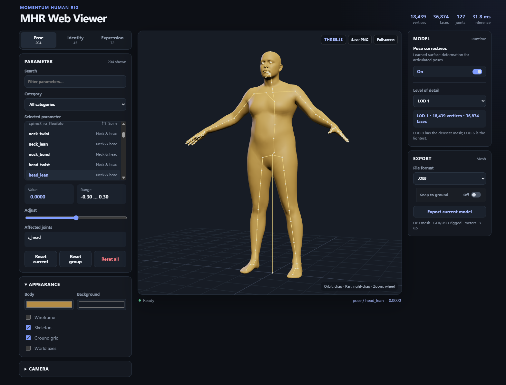

# MHR Web Viewer

A local, interactive web viewer for the [Momentum Human Rig (MHR)](../README.md).
It renders an MHR character with Three.js in the browser and evaluates the
official TorchScript model with a small Flask backend running on the local
machine.

The viewer is intentionally standalone: it reads the model assets from the
parent MHR checkout and does not modify them.



## Features

- Edit all pose, identity, and expression parameters.
- Search and filter pose parameters by anatomical category.
- Toggle pose-corrective deformation and choose LOD 0 through 6.
- Inspect live vertex, face, joint, and inference-time information.
- Orbit, pan, zoom, frame, and switch between perspective, orthographic, and
  cardinal camera views.
- Change body/background colors and show wireframe, skeleton, grid, and axis
  helpers.
- Capture a PNG image and export the evaluated mesh as OBJ, GLB, or USD.

OBJ exports are static meshes. GLB and USD exports include the MHR armature and
four normalized skinning influences per vertex.

## Requirements

- The repository's Python environment (Python 3.11 or later)
- Node.js and npm
- An MHR checkout with its release assets available, including:
  - `assets/mhr_model.pt`
  - `assets/lod0.fbx` through `assets/lod6.fbx`
  - `tools/mhr_LOD_conversion/lod1_to_lodN_mapping.npz`

The viewer is developed as a local application. It binds to `127.0.0.1` by
default and does not require a CDN or frontend build tool.

## Frontend setup

Install the local Three.js dependency from this directory:

```powershell
npm install
```

The browser UI lives in `static/` and is served by the Python server; it does
not need a separate frontend development server or build step.

## Server setup and launch

Use the repository's existing Python environment and install the viewer's
runtime dependencies there if they are not already present:

```powershell
python -m pip install -r requirements.txt
python server.py
```

Then open <http://127.0.0.1:8891>.

`server.py` automatically looks for the model at `../assets/mhr_model.pt`. To
use a different model location or port:

```powershell
python server.py --model "C:\path\to\mhr_model.pt" --port 8891
```

Use `--no-browser` to prevent the server from opening a browser window.

## Generated topology data

The viewer uses the committed `data/lod_topology.npz` archive to render LODs
other than the native LOD 1 topology. To regenerate it after a topology-related
change, run:

```powershell
python tools\build_lod_topology.py
```

The generator reads FBX control-point topology directly. This is important:
general FBX renderers can duplicate vertices at UV/normal seams, which would no
longer align with the official barycentric LOD mappings.

## Testing

Run the backend test suite with the real MHR model assets installed:

```powershell
python -m pytest tests -q
```

The tests cover metadata, parameter updates and resets, LOD changes,
pose-corrective configuration, binary geometry/topology responses, and OBJ,
GLB, and USD exports.

## Architecture

```text
Browser (Three.js)
  static/index.html + static/styles.css + static/app.js
                 | HTTP and packed binary arrays
                 v
Flask server (server.py)
                 | TorchScript inference
                 v
MHR model + official LOD mappings + FBX topology
```

`server.py` owns a single thread-safe character state and evaluates the native
TorchScript LOD 1 model on CPU. Other LODs are produced by applying MHR's
official barycentric mappings to that result. The backend converts the model's
centimeter-space vertices to meters before returning them to Three.js.

`static/app.js` owns UI state, API calls, and the Three.js scene. It keeps one
persistent mesh and updates its position buffer for deformation changes rather
than rebuilding the scene on each parameter edit.

## HTTP API

| Method | Endpoint | Description |
| --- | --- | --- |
| `GET` | `/` | Viewer page |
| `GET` | `/api/metadata` | Parameter definitions, model configuration, and skeleton metadata |
| `GET` | `/api/topology` | Packed little-endian `uint32` triangle indices |
| `GET` | `/api/geometry` | Packed little-endian `float32` vertex and joint positions |
| `POST` | `/api/deform` | Set or reset parameter values |
| `POST` | `/api/configure` | Set LOD, pose correctives, or ground snapping |
| `GET` | `/api/export/{obj|glb|usd}` | Download the evaluated mesh |
| `GET` | `/health` | Server status and active configuration |

Example parameter update:

```json
{
  "action": "set",
  "group": "pose",
  "index": 42,
  "value": 0.25
}
```

## Project layout

```text
MHR/
  assets/                  # Released model weights and FBX assets
  tools/
    mhr_LOD_conversion/    # Official LOD mappings
  web-viewer/
    static/                # Browser UI and Three.js scene
    tests/                 # Backend and export tests
    tools/                 # Generated-topology utility
    data/                  # Committed LOD topology archive
    exporters.py           # OBJ, GLB, and USD writers
    server.py              # Flask API and MHR inference engine
    requirements.txt       # Python dependencies
    package.json           # Three.js dependency
```
